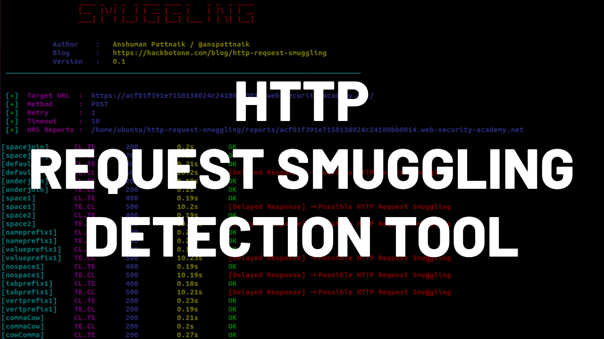

### HTTP Request Smuggling Detection Tool
HTTP request smuggling is a high severity vulnerability which is a technique where an attacker smuggles an ambiguous HTTP request to bypass security controls and gain unauthorized access to performs malicious activities, the vulnerability was discovered back in 2005 by [watchfire](https://www.cgisecurity.com/lib/HTTP-Request-Smuggling.pdf) and later in August 2019 it re-discovered by [James Kettle - (albinowax)](https://twitter.com/albinowax) and presented at [DEF CON 27](https://www.youtube.com/watch?v=w-eJM2Pc0KI) and [Black-Hat USA](https://www.youtube.com/watch?v=_A04msdplXs), to know more about this vulnerability you can refer his well-documented research blogs at [Portswigger website](https://portswigger.net/research/http-desync-attacks-request-smuggling-reborn). So the idea behind this security tool is to detect HRS vulnerability for a given host and the detection happens based on the time delay technique with the given permutes, so to know more about this tool I'll highly encourage you to read my [blog](https://hackbotone.com/blog/http-request-smuggling-detection-tool) post about this tool.



### Technical Overview
The tool is written using python and to use this tool you must have python version 3.x installed in your local machine. It takes the input of either one URL or list of URLs which you need to provide in a text file and by following the HRS vulnerability detection technique the tool has built-in payloads which has around 37 permutes and detection payloads for both CL.TE and TE.CL and for every given host it will generate the attack request object by using these payloads and calculates the elapsed time after receiving the response for each request and decides the vulnerability but most of the time chances are it can be false positive, so to confirm the vulnerability you can use burp-suite turbo intruder and try your payloads.

### Security Consent
It's quite important to know some of the legal disclaimers before scanning any of the targets, you should have proper authorization before scanning any of the targets otherwise I suggest do not use this tool to scan an unauthorized target because to detect the vulnerability it sends multiple payloads for multiple times by using (--retry) option which means if something goes wrong then there is a possibility that backend socket might get poisoned with the payloads and any genuine visitors of that particular website might end up seeing the poisoned payload rather seeing the actual content of the website. So I'll highly suggest taking proper precautions before scanning any of the target website otherwise you will face some legal issue.

### Installation
`````````````````````````````````````````````````````````````````````````````````````````````````````````````````````
git clone https://github.com/anshumanpattnaik/http-request-smuggling.git
cd http-request-smuggling
pip3 install -r requirements.txt
`````````````````````````````````````````````````````````````````````````````````````````````````````````````````````

### Options
`````````````````````````````````````````````````````````````````````````````````````````````````
usage: smuggle.py [-h] [-u URL] [-urls URLS] [-t TIMEOUT] [-m METHOD]
                    [-r RETRY]

HTTP Request Smuggling vulnerability detection tool

optional arguments:
  -h, --help            show this help message and exit
  -u URL, --url URL     set the target url
  -urls URLS, --urls URLS
                        set list of target urls, i.e (urls.txt)
  -t TIMEOUT, --timeout TIMEOUT
                        set socket timeout, default - 10
  -m METHOD, --method METHOD
                        set HTTP Methods, i.e (GET or POST), default - POST
  -r RETRY, --retry RETRY
                        set the retry count to re-execute the payload, default
                        - 2
`````````````````````````````````````````````````````````````````````````````````````````````````

### Scan one Url
````````````````````````````````````
python3 smuggle.py -u <URL>
````````````````````````````````````

### Scan list of Urls
````````````````````````````````````
python3 smuggle.py -urls <URLs.txt>
````````````````````````````````````

### Important
If you feel the detection payload needs to change to make it more accurate then you can update the payload in payloads.json file of detection array.

``````````````````````````````````````````````````````````````````
"detection": [
	{
		"type": "CL.TE",
		"payload": "\r\n1\r\nZ\r\nQ\r\n\r\n",
		"content_length": 5
	},
	{
		"type": "TE.CL",
		"payload": "\r\n0\r\n\r\n\r\nG",
		"content_length": 6
	}
]
``````````````````````````````````````````````````````````````````

### License
This project is licensed under the [MIT License](LICENSE)
